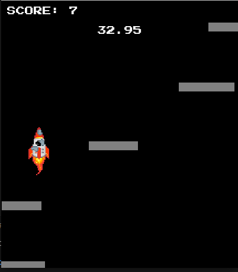

Cosmic Ascension Video Game
===========================

Project Summary
---------------

The goal of this project is to create an interactive program using the Python coding language and the Model-View-Controller design pattern. We created a single player, platformer video game. The player controls a spaceship, with the objective to make it as far from Earth (the bottom) as possible with what fuel they have (simulated by a time limit). If the character falls off a platform, they have failed their mission and have to start again. There are 3 difficulties for players to choose from, easy, medium, and hard. These are dictated by distance between the platforms.

Running Program and Gameplay
----------------------------

[Cosmic Ascension Youtube Video Link](https://youtu.be/4vU0JIXvTUw)

To run our program and play the game, first clone the repository at the following link.

[Cosmic Ascension Repo](https://github.com/olincollege/cosmic-ascension)

Additionally, install Pygame by running **pip install pygame** in your terminal.

Finally, play the game by running the **main.py** file.

### Game Controls

The character sprite is controlled with 3 keyboard keys.

**Left arrow for moving left**

**Right arrow for moving right**

**Space bar to jump**

Authors
-------

### lilyWay27

### fiona-giraffe

### TiredWoofles

Sources
-------
For the rocket engine audio, background music & end screen sound: 

https://pixabay.com/sound-effects/search/revving/

https://pixabay.com/music/upbeat-euphoria-121294/

https://www.soundsnap.com/tags/score

For the character sprite rocketship & flames:

https://www.pixilart.com/art/broken-rocket-ship-5bb8ca8c4a66eb9

https://www.pixilart.com/art/a-little-flame-a0b518a80d32def
